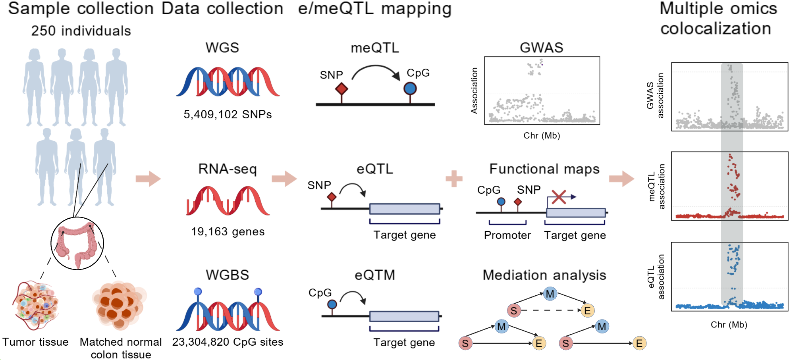

# Genome-wide meQTL mapping reveals genetic control of DNA methylation in colon cancer

## Overview

This repository contains the analysis pipelines for a genome-wide meQTL study of 250 Chinese patients with colon cancer (COACH cohort). Integrating whole-genome sequencing (WGS), whole-genome bisulfite sequencing (WGBS), and RNA sequencing, the study characterizes genetic regulation of DNA methylation at single-base-pair resolution, including meQTL/eQTL/eQTM mapping, colocalization with CRC GWAS loci, and mediation analyses.

## Citation

If you use this code, please cite:

> Hou H, Zhou Y, Chen X, et al. Genome-wide meQTL mapping reveals genetic control of DNA methylation in colon cancer. *Genome Medicine*. Under Review.

A versioned snapshot of this repository is archived on Zenodo:
https://doi.org/10.5281/zenodo.【PLACEHOLDER—填Zenodo_DOI】

## Data availability

Data supporting this study are subject to the regulations of the Human Genetic Resources Administration of China (HGRAC) and are therefore available under controlled access. Access to the dataset is available to qualified researchers upon submission of a research proposal and data security plan.

| Data | Repository | Accession |
|---|---|---|
| Individual-level DNA methylation data (WGBS) | OMIX | [OMIX011553](https://ngdc.cncb.ac.cn/omix/release/OMIX011553) |
| Gene expression data (RNA-seq) | OMIX | [OMIX011530](https://ngdc.cncb.ac.cn/omix/release/OMIX011530) |
| meQTL summary statistics (beta and P-values) | OMIX | [OMIX011554](https://ngdc.cncb.ac.cn/omix/preview/OMIX011554) |
| Genotype data (WGS) | GVM | [PRJCA044670](https://ngdc.cncb.ac.cn/bioproject/browse/PRJCA044670) |
| WGBS and RNA-seq sequencing data | CNSA | [CNP0008089](https://db.cngb.org/data_resources/project/CNP0008089/) |

## License

MIT License — see [LICENSE](./LICENSE).
